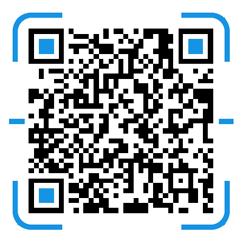

# 翻译协作文档

本翻译计划由翻译[prisma](https://github.com/prisma/prisma) 项目开始，但不仅仅限于该项目，整体包含 prisma 生态和 graphql 生态的很多优秀开源项目。

## 目标

翻译文档的第一目标是开源精神，收益于开源，贡献于开源，帮助更多开发者让世界更美好。第二目标是学习，翻译的过程即是深度学习的过程，带着自己的理解更是深刻，提升自己是永远的过程。

## 要求

### 任务分派

任务分配采用先自愿领取，后接受分配的制度。总目录出来后自行挑选感兴趣的文档，如不挑选，则最后由我进行分配。

### 文档格式

格式化工具为`prettier`，如果使用其他 md 编辑器，那么需要注意格式，比如英文后跟中文需空格等。

### 文档内容

首先要求通顺流畅，错别字不追求完美，但代码需要无误，不能出现中英文字符错误问题。

其次尽量意译，用自己的话进行再述，可加入自己实际开发经验的理解。

最后要求尽量简单易懂，避免知识陷阱，堆砌大量专业词汇。应该用最通俗易懂的语言表述意思。

### 文档更新

另建立原文档库，同步各项目，根据文件 git 更改来修改翻译内容。每月或看情况进行 pull，相关更改由相关翻译成员负责更新。

### 自由发挥

目前目录配置是粗略复制，不可避免丢失一些图片等，另外特殊页面的展示需要处理，各位自行发挥即可，图片统一在`/static`目录下，已设置好项目名称，分门别类即可。

## 协作流程

利用[github project](https://github.com/prisma-cn/translation/projects/1) 进行协作，从 to do 领取任务后，放入 in progress 列，翻译完成后放入 review 列，在翻译中遇到自定义组件的问题自行解决或寻求开发组成员帮助，然后审阅组人员从 review 中选择某项文档进行审阅，通顺无错后签名，我二次审阅后放入 done 列，完成流程。

## 社群

加入社群随时了解最新动态，解决开发难题。

> 人数超过 100 人需邀请
