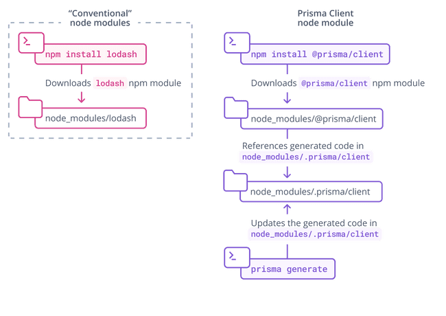

<TopBlock>

Prisma Client 是一个跟据你的数据库 schema 自动生成的定制化数据库客户端 client。默认情况下, Prisma Client 被生成到 `node_modules/.prisma/client` 文件夹下, 但是[你也可以指定一个自定义位置](#using-a-custom-output-path)。

生成并实例化 Prisma Client:

1. 确保你已经[在计算机上安装了 Prisma CLI](../../prisma-cli/installation)。

2. 将以下 `generator` 定义添加到你的 Prisma schema 中:

   ```prisma
   generator client {
     provider = "prisma-client-js"
   }
   ```

3. 安装 `@prisma/client` npm 包:

   ```terminal
   npm install @prisma/client
   ```

   <Admonition type="warning">

   我们建议你保持 `prisma` **和** `@prisma/client`包的版本同步，以避免发生任何意外的错误或行为。

   </Admonition>

4. 使用以下命令生成 Prisma Client:

   ```terminal
   prisma generate
   ```

5. 现在你可以在代码中[实例化 Prisma Client](instantiate-prisma-client):

   <TabbedContent tabs={[<FileWithIcon text="TypeScript" icon="code"/>, <FileWithIcon text="JavaScript" icon="code"/>]}>

   <tab>

   ```ts
   import { PrismaClient } from '@prisma/client'
   const prisma = new PrismaClient()
   // 在你的应用程序中使用 `prisma` 来读取和写入数据库中的数据
   ```

   </tab>

   <tab>

   ```js
   const { PrismaClient } = require('@prisma/client')
   const prisma = new PrismaClient()
   // 在你的应用程序中使用 `prisma` 来读取和写入数据库中的数据
   ```

  </tab>

  </TabbedContent>

> **重要提示**: 每次对 Prisma schema 进行更改后，你都需要重新运行命令 `prisma generate` 去更新生成的 Prisma Client 代码。

下图是 Prisma Client 生成过程的正常流程:


还要注意，`prisma generate` 会在你安装 `@prisma/client` npm 包时*自动* 调用。 所以，当你初始化 Prisma Client 时, 只需要记住上面步骤中的第三步。

</TopBlock>

## `@prisma/client` npm 包

`@prisma/client` npm 包 包含了两个关键部分:

- `@prisma/client` 模块本身, 它只在你重新安装此包时改变
- `.prisma/client` 文件夹。根据你的 schema 会自动生成唯一对应的 Prisma Client ，它所存放的[默认位置](#using-a-custom-output-path)在这里。

`@prisma/client/index.d.ts` 会导出 `.prisma/client` 的类型:

```ts
export * from '.prisma/client'
```

这意味着你仍然需要导入 `@prisma/client` 到你自己的 `.ts` 文件中:

```ts
import { PrismaClient } from '@prisma/client'
```

Prisma Client 是根据你的 Prisma schema 生成的，并且是你的项目所独有的。每次你更改 schema（例如，通过执行[schema migration](../../prisma-migrate)）并运行 `prisma generate` 时，client 的代码都会更改：



`.prisma` 文件夹不受 Node.js 包管理器的[pruning](https://docs.npmjs.com/cli/prune.html) 影响。

## Prisma Client 的位置

如果你没有在 `generator` 块中指定自定义的 `output`路径, Prisma Client 会默认生成在 `./node_modules/.prisma/client` 文件夹. 这是[保持默认目录的一些优点](#why).

### 使用自定义的 `output` 路径 {#using-a-custom-output-path}

你可以在 `generator` 设置中指定一个 `output` 路径, 如下所示 (假设你的 `schema.prisma` 文件位于默认 `prisma` 子文件夹中)：

```prisma
generator client {
  provider = "prisma-client-js"
  output   = "../src/generated/client"
}
```

根据该 schema 文件运行 `prisma generate` 后, 对应的 Prisma Client 包将位于：

```
./src/generated/client
```

从自定义位置(例如, 在名为 `./src/script.ts` 的文件中)导入 `PrismaClient` :

```ts
import { PrismaClient } from './generated/client'
```

### 为什么 Prisma Client 要在默认生成在`node_modules/.prisma/client`下？{#why}

#### 导入 Prisma Client

通过将 Prisma Client 生成进 `node_modules/.prisma/client` 并从 `@prisma/client` 导出这种方式，你可以像下面的示例一样将其导入并在代码中实例化客户端：

```js
import { PrismaClient } from '@prisma/client'

const prisma = new PrismaClient()

// 在你的应用程序中使用 `prisma` 来读取和写入数据库中的数据
```

或

```js
const { PrismaClient } = require('@prisma/client')

const prisma = new PrismaClient()

// 在你的应用程序中使用 `prisma` 来读取和写入数据库中的数据
```

#### 默认将查询引擎二进制文件置于版本控制之外

Prisma Client 的功能基于一个*查询引擎 query engine*，该引擎作为一个 sidecar 进程与你的应用程序同时运行。当 `prisma generate` 被调用后，这个查询引擎的*二进制文件包*被下载并存储在 `output` 路径中。

由于在 `node_modules` 中生成 Prisma Client， 所以默认情况下查询引擎就不受版本控制 (因为 `node_modules` 目录通常会被版本控制系统忽略)。如果它没有生成到 `node_modules` 中, 那么你需要指定忽略目录, 例如对于 Git 来说你需要将 `output` 路径添加到你的 `.gitignore` 文件中。

## 在 `postinstall` hook 中生成 Prisma Client

`@prisma/client` 的包定义了自己的 `postinstall` hook 钩子，当它被安装时就会执行。

这个 hook 调用了 `prisma generate` 命令并在默认位置 `node_modules/.prisma/client`生成 Prisma Client 代码。

注意这里需要 `prisma` 命令是能用的，无论作为本地依赖项或者作为全局依赖被提前安装（建议始终将 `prisma` 包作为开发依赖项，使用 `npm install prisma --save-dev`，以避免版本冲突）。

#### 默认情况下，将查询引擎置于版本控制之外
Prisma Client 使用 [_查询引擎_](../prisma-engines/query-engine)）对数据库运行查询。当调用 `prisma generate` 并将其与生成的客户端一起存储在 `output` 路径中时，将下载此查询引擎。

通过将Prisma Client 生成 `node_modules`，查询引擎通常在默认情况下不受版本控制，因为版本控制通常忽略 `node_modules`。
为生成的Prisma Client 使用自定义 `output` 路径时，建议将其从版本控制中排除。对于Git，这意味着将 `output` 路径添加到 `.gitignore` 文件中。

## 在 `@prisma/client` 的 `postinstall` 钩子中生成 Prisma Client
`@prisma/client` 包定义了自己的 `postinstall` 钩子，每当安装包时都会执行该钩子。此钩子调用 `prisma generate` 命令，该命令将 Prisma Client 代码生成到默认位置 `node_modules/.prisma/client`。请注意，这要求 `prisma` CLI 作为本地依赖项或全局安装可用。尽管如此还是建议始终使用 `npm install prisma --save-dev` 将 `prisma` 包作为开发依赖项安装，以避免版本控制冲突。