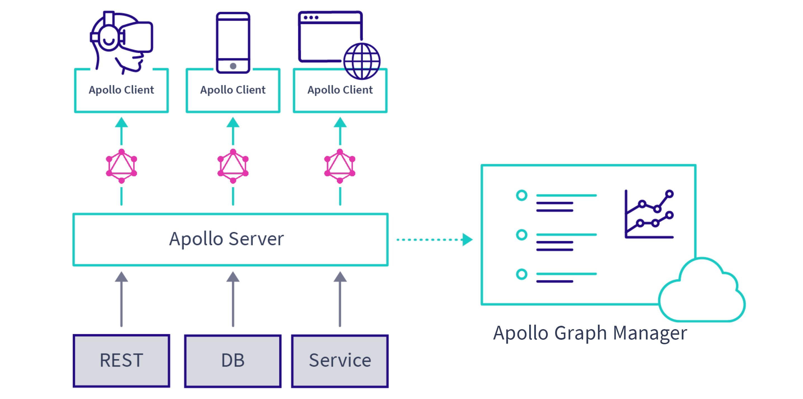

Apollo Graph Manager (formerly Apollo Engine) is a cloud service that helps you manage,
validate, and secure your organization's data graph.

In addition to serving as a GraphQL schema registry, Graph Manager ingests operation metadata and execution trace data from your GraphQL server to help you understand
your schema and query usage.

## Feature summary

**Graph Manager provides the following features to all Apollo users for free:**

- A [GraphQL schema registry](/schema-registry/) that tracks changes
  and enables you to [create variants of your schema](/schema-registry/#managing-environments) for different environments
  (such as staging and production)

- A schema explorer that makes it easy to inspect your schema's queries,
  mutations, and other object definitions

- Team collaboration via [organizations](/accounts-organizations/)

**Advanced features are available to organizations with a subscription to an Apollo Team or Enterprise plan:**

- [Operation safelisting](/operation-registry/)
- [Schema change validation](/schema-validation/)
- [Resolver-level query tracing](/performance/)
- [Third-party integrations](/integrations/)
- [Management of a federated data graph](/federation/)
- Longer data retention

[Learn more about pricing and billing](https://www.apollographql.com/plans/)

## Managing graphs

A **graph** in Graph Manager represents the data graph for a single project or application. Every graph has its own associated GraphQL schema.

### Creating a graph

To create a graph in the Graph Manager interface, first select the Graph Manager
organization that the graph will belong to. Then click **New Graph** in the upper
right and proceed through the creation flow.

Note that every graph in Graph Manager has a globally unique **graph ID**. We recommend that you prefix your graph IDs with the name of your company or organization to avoid naming collisions.

### Viewing graph information

After selecting an organization in Graph Manager, click on a particular graph
to view its data and settings. All of a Graph Manager organization's members have
access to the data and settings for every graph that belongs to that organization.

### Transferring graph ownership

You can transfer a graph to a different Graph Manager organization you belong to
by visiting the graph's Settings page and changing the **graph owner**.

### Deleting a graph

> **Deleting a graph cannot be undone!**

You can delete a graph from Graph Manager by visiting its Settings page and clicking
**Delete**.

### Distinguishing between application environments

Every graph in Graph Manager should correspond to a single application. However, a single
application might run in multiple _environments_ (such as test, staging, and production).

To distinguish between graph activity for different application environments, you can define [**variants**](/schema-registry/#managing-environments) for a graph. Each variant has its own schema
that can (but doesn't have to) differ from the default variant.

When your server sends metrics to Graph Manager, it can associate an operation with
a particular variant. Variants appear as separate items in your organization's graph list, allowing you to view analytics for
each application environment in isolation.

## Ingesting and fetching data

Graph Manager ingests and stores performance metrics data sent from your GraphQL server.
Use one of the following methods to send data to Graph Manager:

- Use [Apollo Server](https://www.apollographql.com/docs/apollo-server/) as your application's GraphQL server and [include a Graph Manager API key](https://www.apollographql.com/docs/tutorial/production/#get-a-graph-manager-api-key) in your server configuration.

- If you aren't using Apollo Server, you can send trace metrics to the [Graph Manager reporting endpoint](https://www.apollographql.com/docs/references/setup-analytics/#graph-manager-reporting-endpoint) (again,
  providing an API key with every request).

### API keys

Any system that communicates with Graph Manager (whether to send metrics or fetch them)
must use an **API key** to do so. You can add and remove API keys from your graph
from its Settings page in the Graph Manager UI.

You should use a different API key for each system that communicates
with Graph Manager. This provides you with more granular control over how Graph
Manager data is sent and accessed.
